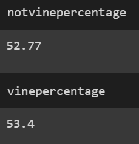

# Amazon_Vine_Analysis

## Overview of the analysis
>Looking over these amazon product reviews, we want to see whether there is any bias in the reviews in the paid group (named "vine" after the name of the paid reviewer program).  We extracted data, transformed it, and loaded it into our RDS.  We then used our vine_table to look at the prevalence of 5-star reviews, comparing that to the reviews that were not part of the paid program.

## Results

*How many Vine reviews and non-Vine reviews were there?
>We started wtih a table that only had tables with 20 or more total votes, and more than half of those also indicating that the review was helpful.  This narrowed the data to 37,475 reviews, of which 103 were paid-vine and the other 37,372 were unpaid-regular ones.
 

*How many Vine reviews were 5 stars? How many non-Vine reviews were 5 stars?
>Of the 37,475 total non-vine reviews, 19,723 were 5-star reviews.  Of the 103 total vine reviews, 55 were 5-star reviews.
 

*What percentage of Vine reviews were 5 stars? What percentage of non-Vine reviews were 5 stars?
>Those totals amount to 53.4% of vine reviews being 5-star and 52.77% of non-vine reviews being 5-star- slightly less in the latter group.
 

## Summary

### Bias
>The analysis we did does not appear to show any significant bias in the Vine program reviews.  An increase of less than 1% doesn't show much slant toward more positive reviews, especially when considering that this sample is only out of 103 reviews compared to the broader 37 thousand!  One would naturally expect the larger data set to "settle" down a bit compared to any smaller sample, which could vary.

### Followup Analysis

>To do further analysis, we could do the exact same analysis, but across different departments.  This work was all done with the "Outdoor" item category.  But it might happen that certain types of items (for example clothes or electronics) could lend more to review bias than others.  It could also be that price would be a factor of the item, but this information was not in our data set(s).
